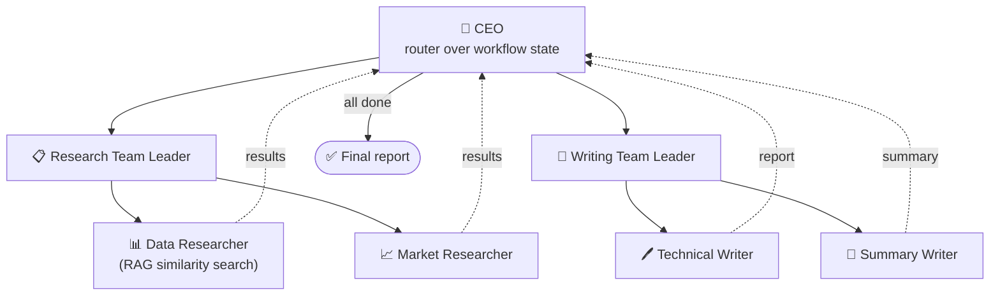

<div align="center">

# 🕸️ LangGraph Workflows

**A hands-on notebook collection for building agents and multi-agent systems with LangGraph — from a 9-cell chatbot to a full CEO-led agent hierarchy.**


[](LICENSE)
[](https://github.com/raj-tembe/LangGraph-Workflows/commits/main)

</div>

---

Seven runnable Jupyter notebooks, each one a self-contained pattern: state graphs, tool calling, ReAct loops, human-in-the-loop interrupts, and multi-agent orchestration — up to a full hierarchical org chart of AI agents with a CEO node routing work between team leads.

## 📖 Table of Contents

- [Notebooks](#-notebooks)
- [Architecture Spotlight: Hierarchical Multi-Agent System](#-architecture-spotlight-hierarchical-multi-agent-system)
- [What's Used Across the Notebooks](#-whats-used-across-the-notebooks)
- [Getting Started](#-getting-started)
- [Environment Variables](#-environment-variables)
- [Running a Notebook](#-running-a-notebook)
- [Resources](#-resources)
- [Contributing](#-contributing)
- [License](#-license)

## 📓 Notebooks

Roughly in the order they build on each other:

| # | Notebook | What it teaches |
|---|---|---|
| 1 | `Build_A_Basic_Chatbot_With_Langgraph.ipynb` | The essentials: `StateGraph`, nodes, edges, and compiling a graph |
| 2 | `Chatbot_with_Tools.ipynb` | Binding a Tavily web-search tool, tool nodes, conditional routing |
| 3 | `Re_Act_Agent.ipynb` | A ReAct-style reasoning → acting → observing loop, with memory |
| 4 | `Human_In_the_Loop.ipynb` | `interrupt()` + checkpointing to pause a graph for human approval and resume it |
| 5 | `simple_multi_ai_agent.ipynb` | A minimal two-agent handoff — researcher → writer, with tool execution in between |
| 6 | `Supervise_MultiAI_Agent_Architecture.ipynb` | A supervisor node routing between researcher, analyst, and writer agents |
| 7 | `Hierarchical_Multi_Agent_System.ipynb` | A full agent hierarchy: a CEO node delegating to team leads, who delegate to specialist agents (see diagram below) |

## 🏗️ Architecture Spotlight: Hierarchical Multi-Agent System

The most involved notebook in the set builds a small AI "org chart." A CEO node reads the workflow state and decides which team needs to act next; team leads then hand off to the specialist who does the actual work (the Data Researcher even does its own RAG retrieval over a vector store before writing its findings):



Routing is dynamic: each node checks boolean flags in shared state (`has_data_research`, `has_market_research`, `has_technical_writing`, `has_summary`) and decides who goes next — the writing team even hands control back to the CEO if it's asked to start before research is complete.

## 🧰 What's Used Across the Notebooks

| Category | What you'll see |
|---|---|
| LLM | Google Gemini (`gemini-2.5-flash`) via `langchain-google-genai` in every notebook |
| Search tool | Tavily (`langchain-tavily` / `TavilySearch`) |
| Core LangGraph | `StateGraph`, `add_node`/`add_edge`, conditional edges, `MessagesState` |
| Agents & memory | `create_react_agent`, `MemorySaver` checkpointing, `interrupt()` for human-in-the-loop |

> **Note:** an alternate LLM path via `ChatGroq` is imported (commented out) in `simple_multi_ai_agent.ipynb`, but Gemini is what actually runs in every notebook as written.

## 🚀 Getting Started

```bash
# 1. Clone
git clone https://github.com/raj-tembe/LangGraph-Workflows.git
cd LangGraph-Workflows

# 2. Create a virtual environment
python3.11 -m venv .venv
source .venv/bin/activate      # Windows: .venv\Scripts\activate

# 3. Install dependencies
pip install --upgrade pip
pip install langgraph langchain langchain-google-genai langchain-tavily langchain-community jupyter python-dotenv
```

> There's no `requirements.txt` in this repo yet — the command above installs everything the notebooks actually import. If you add one (`pip freeze > requirements.txt`), pin the versions you tested with.

## 🔑 Environment Variables

| Variable | Used for | Required |
|---|---|---|
| `GOOGLE_API_KEY` | Gemini, used in every notebook | Yes |
| `TAVILY_API_KEY` | Web search tool | Yes (search-enabled notebooks) |
| `LANGSMITH_API_KEY` | Optional tracing/debugging via LangSmith | Optional |

The notebooks currently set these inline as placeholders, e.g. `os.environ['GOOGLE_API_KEY'] = "xxxxxxxxxxxxxxxxxxx"`. For your own runs, swap that for a `.env` file instead of committing real keys:

```env
GOOGLE_API_KEY=your_google_api_key
TAVILY_API_KEY=your_tavily_api_key
```

```python
from dotenv import load_dotenv
load_dotenv()
```

## ▶️ Running a Notebook

```bash
jupyter lab      # or: jupyter notebook
```

Open any `.ipynb` file and run the cells top to bottom.

**Headless / CI-style execution:**
```bash
jupyter nbconvert --to notebook --execute Hierarchical_Multi_Agent_System.ipynb --inplace
```

**Convert to a plain script:**
```bash
jupyter nbconvert --to script Build_A_Basic_Chatbot_With_Langgraph.ipynb
python Build_A_Basic_Chatbot_With_Langgraph.py
```

## 📚 Resources

- 📖 [LangGraph Documentation](https://docs.langchain.com/langgraph)
- 📖 [LangChain Docs](https://docs.langchain.com/)
- 📖 [LangSmith Debugging](https://docs.langsmith.com/)
- 🎓 [LangChain Academy](https://academy.langchain.com/) — interactive courses
- 💬 [LangChain Discord Community](https://discord.gg/langchain)

## 🤝 Contributing

Contributions are welcome:

1. Fork the repo and add your notebook (clear markdown intro + working cells)
2. Keep API keys out of committed cells — placeholders or `.env` only
3. Update the [Notebooks](#-notebooks) table with your addition
4. Open a PR

## 📄 License

Released under the [MIT License](LICENSE).

---

<div align="center">

**Built while learning LangGraph, one graph at a time.** 🕸️

</div>
